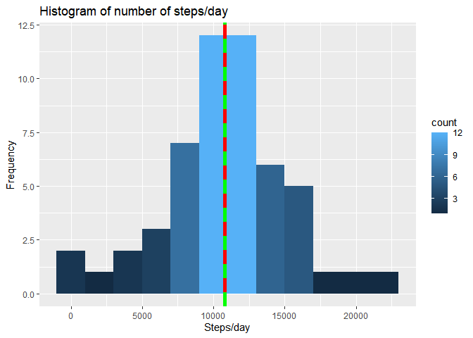
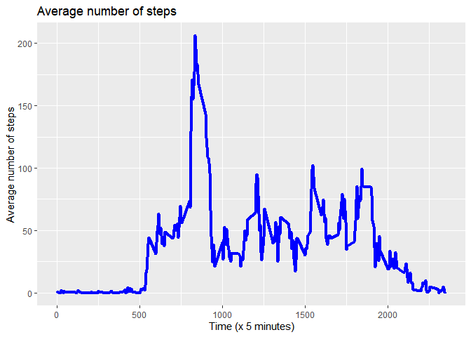
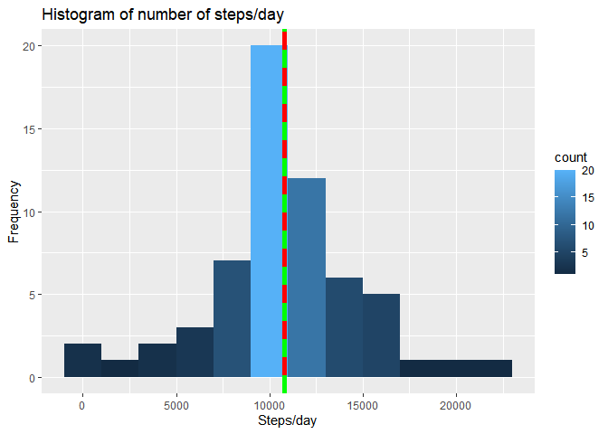
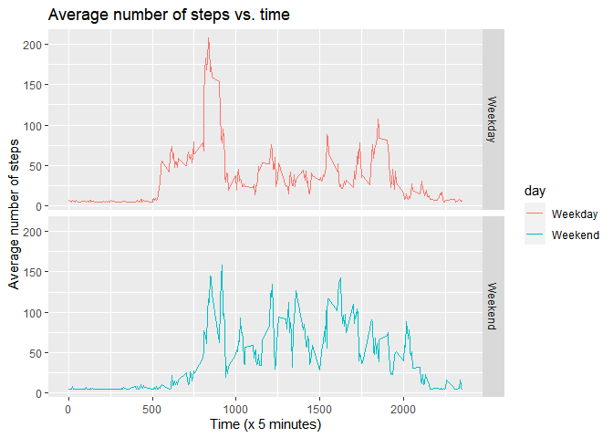

```r
# Clear variables
rm(list=ls()) 
```


```r
# Load packages
library(dplyr)
```

```
## 
## Attaching package: 'dplyr'
```

```
## The following objects are masked from 'package:stats':
## 
##     filter, lag
```

```
## The following objects are masked from 'package:base':
## 
##     intersect, setdiff, setequal, union
```

```r
library(lubridate)
```

```
## 
## Attaching package: 'lubridate'
```

```
## The following objects are masked from 'package:base':
## 
##     date, intersect, setdiff, union
```

```r
library(ggplot2)
library(httpuv)
```
## Loading and preprocessing the data

```r
if (!file.exists("activity.csv")) { 
  unzip("activity.zip") 
}
```


```r
activity0 <- read.csv("activity.csv", header=TRUE, na.strings = "NA")
```


```r
# Remove NA
activity <- na.omit(activity0)
```


```r
# Check
summary(activity)
```

```
##      steps            date              interval     
##  Min.   :  0.00   Length:15264       Min.   :   0.0  
##  1st Qu.:  0.00   Class :character   1st Qu.: 588.8  
##  Median :  0.00   Mode  :character   Median :1177.5  
##  Mean   : 37.38                      Mean   :1177.5  
##  3rd Qu.: 12.00                      3rd Qu.:1766.2  
##  Max.   :806.00                      Max.   :2355.0
```

```r
str(activity)
```

```
## 'data.frame':	15264 obs. of  3 variables:
##  $ steps   : int  0 0 0 0 0 0 0 0 0 0 ...
##  $ date    : chr  "2012-10-02" "2012-10-02" "2012-10-02" "2012-10-02" ...
##  $ interval: int  0 5 10 15 20 25 30 35 40 45 ...
##  - attr(*, "na.action")= 'omit' Named int [1:2304] 1 2 3 4 5 6 7 8 9 10 ...
##   ..- attr(*, "names")= chr [1:2304] "1" "2" "3" "4" ...
```

```r
head(activity, 3)
```

```
##     steps       date interval
## 289     0 2012-10-02        0
## 290     0 2012-10-02        5
## 291     0 2012-10-02       10
```

```r
tail(activity, 3)
```

```
##       steps       date interval
## 17278     0 2012-11-29     2345
## 17279     0 2012-11-29     2350
## 17280     0 2012-11-29     2355
```
## What is mean total number of steps taken per day?

* Histogram of the total number of steps/day
* Mean and median number of steps/day

```r
act <- summarize(group_by(activity,date),daily.step=sum(steps))
```

```
## `summarise()` ungrouping output (override with `.groups` argument)
```


```r
# Mean total number of steps/day
mean.act <- as.integer(mean(act$daily.step))
sprintf("Mean number of steps/day = %g", mean.act)
```

```
## [1] "Mean number of steps/day = 10766"
```


```r
# Median total number of steps/day
median.act <- as.integer(median(act$daily.step))
sprintf("Median number of steps/day = %g", median.act)
```

```
## [1] "Median number of steps/day = 10765"
```


```r
# Plot histogram
plot.steps.day <- ggplot(act, aes(x=daily.step)) + 
  geom_histogram(binwidth = 2000, aes(y=..count.., fill=..count..)) + 
  geom_vline(xintercept=mean.act, colour="red",  size=2) +
  geom_vline(xintercept=median.act, colour="green" , linetype="dashed", size=2) +
  labs(title="Histogram of number of steps/day", y="Frequency", x="Steps/day") 
plot.steps.day
```

<!-- -->

## What is the average daily activity pattern?


* Time series plot of the average number of steps taken

```r
act <- activity %>% group_by(interval) %>% summarize(mean.step=mean(steps))
```

```
## `summarise()` ungrouping output (override with `.groups` argument)
```


```r
plot.step.interval <- ggplot(act, aes(x=interval,y=mean.step)) + 
  geom_line(color="blue",size=1.5) + 
  labs(title="Average number of steps", y="Average number of steps", x="Time (x 5 minutes)")
plot.step.interval
```

<!-- -->

* The 5-minute interval that, on average, contains the maximum number of steps

```r
optimal <- which.max(act$mean.step)
optimal.step <- act$interval[optimal]
sprintf("Maximum number of steps @  %gth 5-min interval", optimal.step)
```

```
## [1] "Maximum number of steps @  835th 5-min interval"
```

## Imputing missing values

* Code to describe and show a strategy for imputing missing data

  + a. Calculate and report the total number of missing values in the dataset (i.e. the total number of rows with NAs)

```r
sum(is.na(activity0)) 
```

```
## [1] 2304
```
  + b. Devise a strategy for filling in all of the missing values in the dataset. 
     The strategy does not need to be sophisticated. For example, you could use the 
     mean/median for that day, or the mean for that 5-minute interval, etc.

```r
impute.act <- activity0
impute.act$steps[is.na(impute.act$steps)] <- mean(impute.act$steps,na.rm=TRUE)
impute.act$steps <- as.numeric(impute.act$steps)
impute.act$interval <- as.numeric(impute.act$interval)
colSums(is.na(impute.act))
```

```
##    steps     date interval 
##        0        0        0
```

  + c. Create a new dataset that is equal to the original dataset but with the missing data filled in.

```r
summary(activity0)
```

```
##      steps            date              interval     
##  Min.   :  0.00   Length:17568       Min.   :   0.0  
##  1st Qu.:  0.00   Class :character   1st Qu.: 588.8  
##  Median :  0.00   Mode  :character   Median :1177.5  
##  Mean   : 37.38                      Mean   :1177.5  
##  3rd Qu.: 12.00                      3rd Qu.:1766.2  
##  Max.   :806.00                      Max.   :2355.0  
##  NA's   :2304
```

```r
summary(impute.act)
```

```
##      steps            date              interval     
##  Min.   :  0.00   Length:17568       Min.   :   0.0  
##  1st Qu.:  0.00   Class :character   1st Qu.: 588.8  
##  Median :  0.00   Mode  :character   Median :1177.5  
##  Mean   : 37.38                      Mean   :1177.5  
##  3rd Qu.: 37.38                      3rd Qu.:1766.2  
##  Max.   :806.00                      Max.   :2355.0
```
  + d. Make a histogram of the total number of steps taken each day and Calculate and report the mean and median total number of steps taken per day. Do these values differ from the estimates from the first part of the assignment? What is the impact of imputing missing data on the estimates of the total daily number of steps?

```r
# Summarize data by date
impute.act2 <- summarize(group_by(impute.act,date),daily.step=sum(steps))
```

```
## `summarise()` ungrouping output (override with `.groups` argument)
```


```r
mean.impute   <- as.integer(mean(impute.act2$daily.step))
sprintf("Mean number of steps/day = %g", mean.impute)
```

```
## [1] "Mean number of steps/day = 10766"
```


```r
median.impute <- as.integer(median(impute.act2$daily.step))
sprintf("Median number of steps/day = %g", median.impute)
```

```
## [1] "Median number of steps/day = 10766"
```

  + e. Histogram of the total number of steps taken each day after missing values are imputed

```r
plot.steps.day <- ggplot(impute.act2, aes(x=daily.step)) + 
  geom_histogram(binwidth = 2000, aes(y=..count.., fill=..count..)) + 
  geom_vline(xintercept=mean.impute, colour="red",  size=2) +
  geom_vline(xintercept=median.impute, colour="green" , linetype="dashed", size=2) +
  labs(title="Histogram of number of steps/day", y="Frequency", x="Steps/day") 
plot.steps.day
```

<!-- -->

## Are there differences in activity patterns between weekdays and weekends?

* Panel plot comparing the average number of steps taken per 5-minute interval across weekdays and weekends

 + a. Create a new factor variable in the dataset with two levels – “weekday” and “weekend” indicating whether a  given date is       a weekday or weekend day.


```r
impute.act$day <- ifelse(weekdays(as.Date(impute.act$date)) %in% c("Saturday","Sunday"),  "Weekend","Weekday")
```
 + b.Make a panel plot containing a time series plot (i.e. \color{red}{\verb|type = "l"|}type = "l") 
   of the 5-minute interval (x-axis) and the average number of steps taken, averaged across all weekday days or 
   weekend days (y-axis). See the README file in the GitHub repository to see an example of what this plot should 
   look like using simulated data.


```r
df <- impute.act %>% group_by(interval,day) %>% summarise(mean.step=mean(steps))
```

```
## `summarise()` regrouping output by 'interval' (override with `.groups` argument)
```


```r
plot.weekday.interval <- ggplot(df, aes(x=interval, y=mean.step, color=day)) + 
  facet_grid(day~.) +
  geom_line() + 
  labs(title="Average number of steps vs. time", y="Average number of steps", x="Time (x 5 minutes)")
plot.weekday.interval
```

<!-- -->
